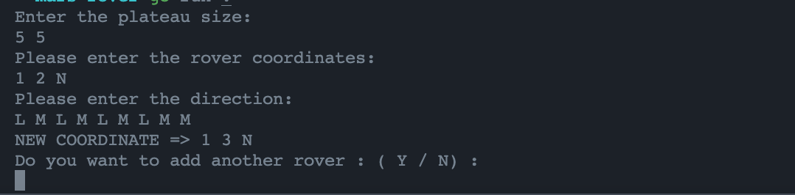

## About this project
A squad of robotic rovers are to be landed by NASA on a plateau on Mars. This plateau, which is curiously rectangular, must be navigated by the rovers so that their on board cameras can get a complete view of the surrounding terrain to send back to Earth.
A rover's position and location is represented by a combination of x and y co-ordinates and a letter representing one of the four cardinal compass points. The plateau is divided up into a grid to simplify navigation. An example position might be 0, 0, N, which means the rover is in the bottom left corner and facing North.
In order to control a rover, NASA sends a simple string of letters. The possible letters are 'L', 'R' and 'M'. 'L' and 'R' makes the rover spin 90 degrees left or right respectively, without moving from its current spot. 'M' means move forward one grid point, and maintain the same heading.
## Installation & Run

```bash
# Clone this project
git clone https://github.com/emrecavdar94/mars-rover.git
# Install all dependencies
go get ./...
```

```bash
# Build and Run
go build
./mars-rover
```

## Using
# A space is required between each command.
1. App ask you for plateau size (Example Input : 5 5)
2. Enter rover coordinate and direction (Example Input 1 2 N)
    **1 2 is coordinates of rover reresented as x and y coordinate. N is direction of rover.**
3. Finally enter command to move rover (Example Input : L M L M L M L M M)
4. App ask if you want to add a different rover.

## Screenshots
